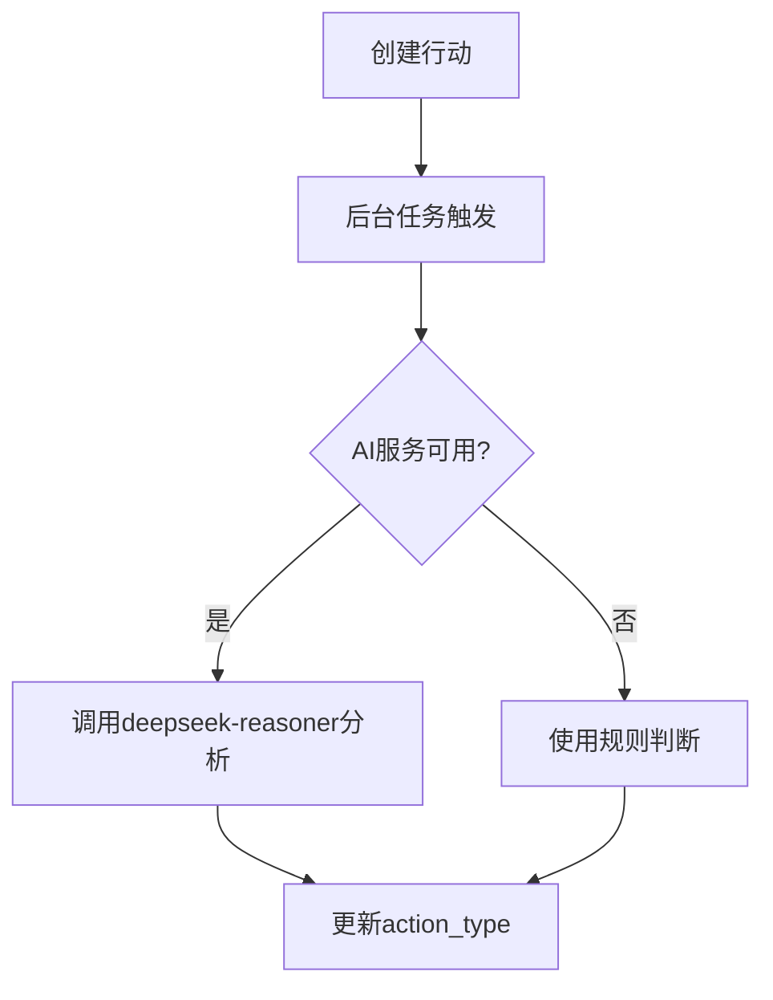
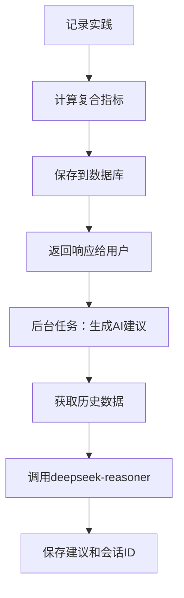

# 行为分析与智能反馈系统实施总结

## 概述
本次更新实现了基于讨论的核心需求，将应用升级为智能行为分析系统，支持情境触发型和习惯养成型行为的分类管理，并提供AI驱动的个性化建议。

---

## 实施阶段

### ✅ 阶段1：数据模型增强
**文件**：`app/models.py`

**新增字段**：

1. **Action模型**：
   - `action_type` (String): 行为类型（"trigger"触发型 / "habit"习惯型）
   - `ai_analysis` (Text): AI生成的行为分析和建议
   - `advice_session_id` (String): 建议对话会话ID

2. **PracticeLog模型**：
   - `objective_completion` (Float): 客观完成度 (0.0-1.0)
   - `success_score` (Float): 复合成功指标 (0.0-1.0)

**复合指标公式**：
```python
success_score = (objective_completion * 0.6) + (subjective_rating * 0.4)
```

---

### ✅ 阶段2：Schema定义更新
**文件**：`app/schemas.py`

**新增内容**：

1. **枚举类型**：
   - `ActionType`: 行为类型枚举（TRIGGER/HABIT）

2. **响应模型增强**：
   - `ActionResponse`: 添加行为类型和AI分析字段
   - `PracticeLogResponse`: 添加复合指标字段

3. **新增模型**：
   - `ActionAdviceRequest`: AI建议请求
   - `ActionAdviceResponse`: AI建议响应
   - `AnalysisExportRequest`: 导出分析请求
   - `AnalysisExportResponse`: 导出分析响应

---

### ✅ 阶段3：AI服务升级
**文件**：`app/ai_service.py`

**核心功能**：

1. **多模型路由系统**：
   ```python
   MODEL_MAPPING = {
       "extraction": "deepseek-chat",      # 行动抽取
       "analysis": "deepseek-reasoner",    # 行为分析
       "reasoning": "deepseek-reasoner"    # 推理任务
   }
   ```

2. **行为类型智能识别**：
   - `analyze_action_type()`: 基于行动描述、频率和标签自动判断行为类型
   - 使用`deepseek-reasoner`模型进行深度分析

3. **个性化建议生成**：
   - `generate_action_advice()`: 根据行动结果和历史数据生成建议
   - 支持情境触发型和习惯养成型的差异化建议

4. **建议对话扩展**：
   - `continue_advice_conversation()`: 支持多轮对话深入讨论

---

### ✅ 阶段4：行动记录逻辑增强
**文件**：`app/routers/actions.py`

**新增功能**：

1. **复合指标计算**：
   - `calculate_success_score()`: 自动计算复合成功指标
   - 同时考虑客观完成度和主观评分

2. **后台任务机制**：
   - `background_analyze_action_type_task()`: 异步分析行为类型
   - `background_generate_advice_task()`: 异步生成AI建议
   - 不阻塞主流程，提升用户体验

3. **新增API端点**：
   - `POST /{action_id}/advice-chat`: 与AI进行建议对话
   - `GET /{action_id}/advice`: 获取行动的AI建议
   - `GET /{action_id}/export`: 导出行动分析报告

---

### ✅ 阶段5：统计计算重构
**文件**：`app/routers/dashboard.py`

**分类统计系统**：

1. **按类型统计**：
   - `GET /stats/by-type`: 按行为类型获取统计（可选trigger/habit）
   - 支持时间范围筛选

2. **对比分析**：
   - `GET /stats/trigger-vs-habit`: 对比两种行为类型的表现
   - 返回成功率、平均分数等对比数据

3. **详细分析**：
   - `GET /stats/action-details/{action_id}`: 单个行动的详细统计
   - 包含总尝试次数、成功率、平均分数、连续天数、最近趋势

**统计维度**：
- **触发型行为**：成功率（成功次数/总次数）
- **习惯型行为**：坚持率（完成天数/目标天数）+ 成功率

---

### ✅ 阶段6：导出功能实现
**文件**：`app/routers/actions.py`

**导出格式支持**：

1. **纯文本格式** (`plain_text`):
   - 适合直接复制粘贴
   - 包含完整的行动信息和统计数据

2. **Markdown格式** (`markdown`):
   - 适合文档整理
   - 支持格式化展示

**导出内容**：
- 基本信息（行动描述、类型、标签等）
- 统计数据（成功率、平均分数等）
- AI建议
- 最近记录（最近5次）
- 生成时间

---

## API端点总览

### 新增端点

| 方法 | 路径 | 说明 |
|------|------|------|
| POST | `/actions/{action_id}/advice-chat` | 与AI进行建议对话 |
| GET | `/actions/{action_id}/advice` | 获取行动AI建议 |
| GET | `/actions/{action_id}/export` | 导出行动分析报告 |
| GET | `/dashboard/stats/by-type` | 按行为类型统计 |
| GET | `/dashboard/stats/trigger-vs-habit` | 对比触发型vs习惯型 |
| GET | `/dashboard/stats/action-details/{action_id}` | 单个行动详细统计 |

### 修改的端点

| 方法 | 路径 | 变更说明 |
|------|------|----------|
| POST | `/actions/{action_id}/practice` | 添加复合指标计算和异步AI建议生成 |
| GET | `/actions/` | 响应中添加行为类型和AI分析字段 |

---

## 数据库迁移

### 迁移脚本
**文件**：`migrate_add_new_features.py`

**执行方式**：
```bash
python migrate_add_new_features.py
```

**迁移内容**：
1. 向`actions`表添加3个新字段
2. 向`practice_logs`表添加2个新字段
3. 为现有记录计算`success_score`
4. 向后兼容，不影响现有数据

---

## 核心业务逻辑

### 1. 行为类型识别流程



### 2. 实践记录与建议生成流程



### 3. 统计计算逻辑

**触发型行为**：
- 核心指标：成功率 = 成功次数 / 总尝试次数
- 不考虑连续性，只看结果

**习惯型行为**：
- 核心指标：坚持率 = 完成天数 / 目标天数
- 附加指标：当前连续天数、最长连续天数

---

## 使用示例

### 1. 记录实践（带复合指标）

```bash
POST /actions/1/practice
{
  "date": "2025-10-08",
  "result": "success",
  "rating": 4,
  "objective_completion": 0.9,
  "notes": "完成得很顺利"
}
```

响应将包含自动计算的`success_score`：
```json
{
  "id": 123,
  "success_score": 0.78,
  ...
}
```

### 2. 获取AI建议

```bash
GET /actions/1/advice
```

响应：
```json
{
  "advice": "你在这个行动上表现很好...",
  "session_id": "uuid-xxx"
}
```

### 3. 与AI深入对话

```bash
POST /actions/1/advice-chat
{
  "message": "我应该如何提高成功率？"
}
```

### 4. 按类型统计

```bash
GET /dashboard/stats/by-type?action_type=habit&days=30
```

响应：
```json
{
  "action_type": "habit",
  "total_actions": 5,
  "success_rate": 75.5,
  "average_score": 0.82,
  ...
}
```

### 5. 导出分析报告

```bash
GET /actions/1/export?format=markdown
```

---

## 技术亮点

### 1. 异步处理架构
- 使用FastAPI的`BackgroundTasks`机制
- AI分析不阻塞用户操作
- 提升系统响应速度

### 2. 多模型智能路由
- 根据任务类型自动选择最合适的AI模型
- `deepseek-chat`用于快速任务
- `deepseek-reasoner`用于复杂推理

### 3. 复合指标系统
- 结合客观和主观评价
- 灵活权重配置（60%客观 + 40%主观）
- 向后兼容旧数据

### 4. 分类统计引擎
- 触发型和习惯型分别统计
- 支持多维度对比分析
- 灵活的时间范围筛选

---

## 向后兼容性

### 1. 数据库层面
- 所有新字段均设置为可空或有默认值
- 现有数据自动补全`success_score`
- 迁移脚本支持增量更新

### 2. API层面
- 所有新字段在响应中为可选
- 现有端点保持兼容
- 新端点不影响旧流程

### 3. 业务逻辑
- AI服务不可用时使用规则引擎
- 复合指标自动推断缺失值
- 分类统计支持未分类数据

---

## 性能优化

### 1. 数据库查询
- 使用索引（action_type字段）
- 批量查询减少往返
- 时间范围筛选减少数据量

### 2. AI调用
- 异步处理避免阻塞
- 重试机制提高成功率
- 超时控制防止长时间等待

### 3. 缓存策略（建议实施）
- 统计数据可缓存（TTL: 1小时）
- AI建议可缓存（基于会话ID）
- 导出内容可缓存（TTL: 30分钟）

---

## 后续扩展建议

### 1. 前端集成
- 实现双栏展示（触发型 vs 习惯型）
- 添加图表可视化组件
- 实现一键复制按钮

### 2. 高级功能
- PDF导出支持
- 图表快照生成
- 分享链接机制
- Notion集成

### 3. AI能力增强
- 行为模式识别
- 趋势预测
- 个性化建议推荐
- 自动目标调整

---

## 测试建议

### 1. 单元测试
- 复合指标计算函数
- 行为类型识别逻辑
- 统计计算准确性

### 2. 集成测试
- 完整的实践记录流程
- AI建议生成流程
- 导出功能

### 3. 性能测试
- 大量数据统计查询
- 并发AI调用
- 导出大报告

---

## 部署清单

- [x] 代码修改完成
- [x] 数据库迁移脚本准备
- [ ] 执行数据库迁移
- [ ] 验证API端点
- [ ] 测试AI服务集成
- [ ] 前端适配（如需要）
- [ ] 用户文档更新
- [ ] 生产环境部署

---

## 联系与支持

如有问题或建议，请参考以下资源：
- 代码仓库：查看详细实现
- API文档：访问 `/docs` 查看OpenAPI文档
- 迁移脚本：`migrate_add_new_features.py`
- 本文档：`IMPLEMENTATION_SUMMARY.md`

---

**版本**: 2.0
**更新日期**: 2025-10-08
**状态**: ✅ 实施完成

